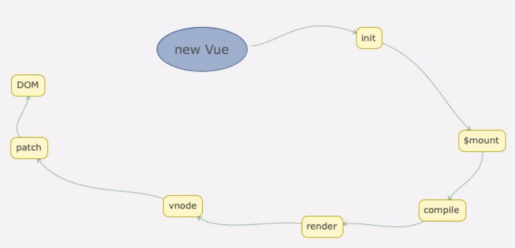

# Vue源码分析

饭要一口一口的吃,熟悉主要的Vue原理就可以

看懂这个图


## 数据驱动

### 挂载

**挂载:**目的是把模板渲染成最终DOM,调用的是`vm.$mount`方法

`/platforms/web/entry.runtime-with-compiler.js`文件

首先转换成确定`options.render`函数,该函数可以是用户自己写的,如果没有就判断是否有`template`有则转换成`render`函数, 没有则调用`getOuterHTML(el)`转换成`render`函数

`/platforms/web/runtime/index.js`文件

完成上一步后,调用`mountComponent()`方法

`/core/instance/lifecycle.js`文件中`mountComponent()`方法

`mountCompent`的主要作用就是 一个调用render函数生成VNode, 第二个初始化一个渲染`Watcher`,初始化渲染

`mountComponent`核心就是先调用`vm._render`方法 先生成虚拟Node,然后再实例化一个渲染`Watcher`,在它的回调中调用`updateComponent`方法,最终调用`vm._update`更新DOM

`Watcher`在这里两个作用,一个是初始化的时候会执行回调函数, 另一个是当vm实例中监测的数据发生变化的时候执行回调函数

函数的最后`vm.$vnode`表示Vue实例的父虚拟Node, 如果为`null`,就表示当前是Vue根实例,设置了`vm._isMounted`为true, 同时执行`mounted`钩子函数


### render函数

**render:**Vue的_render是一个私有方法,它用来把实例渲染成一个虚拟Node

`/core/instance/render.js`文件

在官方文档中`render`函数的第一个参数就是`createElement`方法,从源码中可以看到

```js
vnode = render.call(vm._renderProxy, vm.$createElement)
```

`createElement`就是这个`vm.$createElement`

而这个方法的定义其实是在`initRender`方法执行时定义的,可以看到`vm.createElement`方法调用的是`createElement`方法


### Virtual Dom

**Virtual Dom:**谈一谈你对虚拟DOM的认识

**首先: 为什么需要用到`Virtual DOM`?**

 真正的DOM元素元素上有非常多的属性,当我们频繁的去做DOM更新,会产生一定的性能问题,而`Virtual DOM`是用一个JS对象去描述一个节点,所以它比创建一个真实的DOM付出的代价要小

Vue中在`/core/vdom/vnode.js`中定义了一个类来描述`Virtual DOM`

**然后: 谈一谈Virtual DOM **

虚拟DOM就是真实DOM的一种抽象描述,他的核心定义无非就是几个关键字,标签名, 数据, 子节点 等, 其他属性都是用来扩展VNode的灵活性,由于VNode只是用来映射到真实DOM的渲染, 不包含操作DOM的方法, 所以它十分的轻量,VNode除了定义它的数据结构, 映射到真实的DOM实际要经历VNode的create, diff, pathc等过程,Vue的VNode中的create就是上面的`createElement`

### CreateElement 方法

**createElement方法:**创建虚拟DOM, 有点复杂...

`createElement`创建VNode,每个VNode有`children`, `children`每个元素也是VNode,这就形成了`VNode tree`他很好的描述了`Dome Tree`

至此我们知道了`mountComponent`函数中的`vm._render`是如何创建一个`VNode`的了,接下来就是搞懂把`VNode`渲染成一个真实的DOM这个过程,`vm._update`


### update 方法

**update:**将虚拟DOM转换成真实DOM

Vue中的`_update`是实例上一个私有方法,它调用的时机有两个, 一个是首次渲染, 一个是数据更新的时候

`core/instance/lifecycle.js`中

`_update`核心是调用了`vm.__patch__`方法,该方法在各个平台调用不同,在web平台上, 方法是在`platforms/runtime/pathc.js`文件中, 这里调用了`createPatchFunction`函数

 `core/vdom/patch.js`文件

... ... 总之整个过程就是递归创建一个完整的DOM数并插入到Body上

### 总结

new Vue后整个初始化渲染过程 : 初始化 => $mount(挂载) => compile(编译生成render函数) => render => VNode => patch => DOM



到这就可以回答**new Vue()后都发生了什么?**这个问题了


## 组件

主要是讲的是渲染组件和渲染普通的标签的不同之处

 首先`createComponent`函数, 创建了一个

### createComponent

首先`render`函数转换VNode调用的是`createElement`方法, 该方法调用的是

`core/vdom/create-element.js` 中的`_createElement`方法,在这个方法中判断`render`函数如果不是`tag`,而是一个组件的话,调用`createComponent`方法

`core/vdom/create-component.js`

整个createComponent主要关注三个关键步骤:

+ 构造子类构造函数

  创建了一个Vue的子类,然后扩展了`options`,添加了全局的API, 和对 `props`和`computed`初始化, 当我们去实例这个子类的时候,会执行`this._init`逻辑再次走到了`Vue`实例的初始化逻辑

+ 安装组件钩子函数

  定义了一些组件的钩子函数,然后合并到`data.hook`中, 当`VNode`执行`patch`的过程中就会执行这个钩子函数

+ 生成VNode

  直接`new VNode`实例化一个`vnode`并返回, 和普通的元素节点的`vnode`不同,组件的`vnode`没有`children`

主要就是说如果`render`函数传入的是一个组件,创建`VNode`使用的就是`createComponent`方法,然后在这个函数中,主要做的有三件事情

`创建一个Vue子类`,当然扩展了一些属性和方法,因为继承的是`Vue`,所以实例化进行初始化操作时运行的还是`Vue`的初始化逻辑

`安装组件钩子函数`,其实就是定义了一些组件创建过程中的`钩子函数`,然后合并到了`data.hook`这个属性中,后面组件的`VNode`执行`patch`创建的过程中,就会触发这些`钩子函数`

`实例化VNode`,创建一个组件的`VNode`, 需要注意的时组件的`VNode`没有`children`属性


### patch

需要掌握的东西主要分为三个

+ 了解组件patch的过程
+ 了解组件patch流程中的 activeInstance, vm.$vnode, vm_vnode
+ 了解嵌套组件的插入顺序

卧槽 太难了 😥 先缓缓


