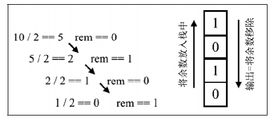

# JS数据结构与算法笔记

逐行逐句,认真记录

## 栈

### 栈数据结构

**栈**是一种**后进先出**的有序集合,新添加和待删除的元素都保存再栈的同一端,称之为栈顶,另一端就叫做栈底,在栈里新元素都靠近栈顶,就元素都接近栈底

> 类似生活中的叠放的盘子, 添加和拿走的盘子 总是在上面

### 创建一个基于数组的栈

我们创建一个类来表示一个栈, 然后需要选择一个数据结构来保存栈里的元素,这里我们可以选择一个数组,因为数组允许我们在任何位置来添加和删除元素,因为栈需要满足**后进先出**的原则, 我们可以为我们栈添加一些方法

+ **push()** :  添加元素到栈顶
+ **pop()**: 移除栈顶的元素,同时返回被移除的元素
+ **peek()**: 返回栈顶的元素
+ **isEmpty()**: 如果栈里没有任何元素 返回 true , 否则 返回 false
+ **clear()**: 清空栈里的元素
+ **size()**: 返回栈里的元素个数

```js
class Stack {
	constructor() {
		this.items = []
	}
 	push(element) {
        this.times.push(element)
    }
    pop() {
        return this.items.pop()
    }
    peek() {
        return this.items[this.items.length -1]
    }
    isEmpty() {
        return this.items.length === 0
    }
    clear() {
        this.items = []
    }
    size() {
        return this.items.length
    }
}

// 使用
const stack = new Stack()
```


### 创建一个基于对象的栈

创建一个栈类最简单的方法是使用一个数组来存储其元素,在处理大量元素的时候,我们同样需要评估如何操作数据更加的有效,在使用数组时存在两个缺点

+ 大部分方法的时间复杂度是O(n), 意思就是我们需要迭代整个数组才能找到那个元素
+ 还有一个原因,数组是元素的一个有序集合,为保证有序,所以占用的内参空间更多

所以我们可以用一个对象来存储所有的栈元素,保证顺序和遵循**后进先出**的条件实现

```js
class Stack {
    constructor() {
        this.count = 0
        this.items = {}
    }
    push(element) {
        this.items[this.count] = element
        this.count++
    }
    size() {
        return this.count
    }
    isEmpty() {
        return this.count === 0
    }
    pop() {
        if (this.isEmpty()) return undefined;
        this.count--
        const result = this.items[this.count]
        delete this.times[this.count]
        return result
    }
    peek() {
        if (this.isEmpty()) return undefined;
        return this.items[this.count -1]
    }
    clear() {
        this.items = {}
        this.count = 0
    }
    toString() {
        if (this.isEmpty()) return undefined;
        let objString = `${this.items[o]}`
        for (let i = 1; i < this.count; i++) {
            objString = `${objString},${this.items[i]}`
        }
        return objString;
    }
```

### 保护数据结构内部元素

在创建别的开发这也可以使用的数据结构和对象时,我们希望保护内部元素,只有我们暴露出的方法才能修改内不数据结构

```js
const stack = new Stack()
console.log(Object.getOwnPropertyNames(stack)) // ['items', 'count']
console.log(Object.keys(stack)) // ['items', 'count']
console.log(stack.items)
```

从上面的代码可以看出count和items属性是公开的,这样不好

我们上面使用的是ES6的class创建的类,calss创建类是基于原型的,这种方式不能声明私有属性和方法

#### 使用Symbol实现

ES6新增了一个Symbol的基本类型,它是不可变的,可以用作对象的属性

```js
const _items = Symbol('stackItems')
class Stack {
    constructor() {
        this[_items] = {}
    }
}
```

我们把代码中的所有的items属性都替换成_items就可以了

但是这种方法创建了一个假的私有属性,因为ES6新增了一个`Object.getOwnPropertySymbols()`方法,可以获取到类里面声明的所有的Symblo属性

```js
const stack = new Stack()
const objSymbols = Object.getOwnPropertySymbols(stack)
stack[objSymbols[0]]
```

还是可以操作栈中的数据,不行再换一种

#### 使用WeakMap实现

有一种数据结构可以确保属性的私有,就是`WeakMap`,它可以存储键值对,其中键是对象,值是任意数据类型

```js
const items = new WeakMap()
class Stack {
    constructor() {
        items.set(this, [])
    }
    push(element) {
        const s = item.get(this)
        s.push(element)
    }
}
```

以上代码解释

+ 声明一个WeakMap类型的变量items
+ 在constructor中,以this(Stack类自己的引用)为键,把栈的数组存入items

这样实现了真正的私有变量,采用这种方法,代码的可读性不强,而且在扩展该类时无法继承私有变量

> 在TypeScript中提供给了类访问修饰符,其中的private修饰符表示属性为私有属性, 但是改修是符只有在编译时有用,编译后还是公开的属性

### 用栈解决问题

栈的实际应用非常广泛, 后面还有很多例子, 这里就介绍一个如何解决十进制转二进制问题

**十进制转二进制** : 将十进制数除以2,然后对商取整,直到结果为0

过程大概如下



来来来,给公子喂饼

```js
function decimalToBinary(decNumber) {
    
    
}
```

